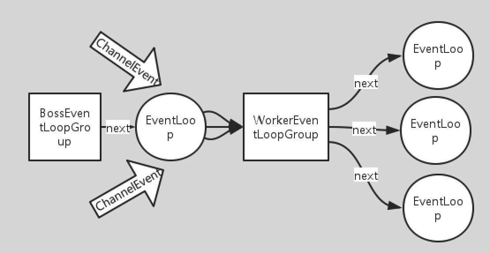

# netty 4
在介绍netty之前，可以先回顾一下java原生nio包是如何编写服务端的，这样方便体现出netty的优势。
## nio复习
java原生的nio底层内容暴露的比较多，不利于快速编写业务逻辑，以下面代码为例：
```java
public class NIOServer {

    public static void main(String[] args) throws IOException {
        Selector selector = Selector.open();
        ServerSocketChannel ssChannel = ServerSocketChannel.open();
        // 设置为非阻塞，即accept为非阻塞
        ssChannel.configureBlocking(false);
        // 把ServerSocketChannel注册到selector上，并且指定SelectionKey.OP_ACCEPT，表示只接受连接,不处理数据。
        ssChannel.register(selector, SelectionKey.OP_ACCEPT);

        ServerSocket serverSocket = ssChannel.socket();
        InetSocketAddress address = new InetSocketAddress("127.0.0.1", 8888);
        serverSocket.bind(address);

        while (true) {
            // 轮询阻塞，直到有server的accept或client的read事件产生
            selector.select();
            // keys包含所有有事件的channel
            Set<SelectionKey> keys = selector.selectedKeys();
            Iterator<SelectionKey> keyIterator = keys.iterator();
            while (keyIterator.hasNext()) {
                SelectionKey key = keyIterator.next();
                if (key.isAcceptable()) {
                    // 有客户端进行tcp连接
                    ServerSocketChannel ssChannel1 = (ServerSocketChannel) key.channel();
                    // 服务器会为每个新连接创建一个 SocketChannel
                    SocketChannel sChannel = ssChannel1.accept();
                    // 设置为非阻塞
                    sChannel.configureBlocking(false);
                    // 这个新连接主要用于从客户端读取数据，即制定SelectionKey.OP_READ
                    sChannel.register(selector, SelectionKey.OP_READ);
                } else if (key.isReadable()) {
                    // 处理客户端发来的报文
                    SocketChannel sChannel = (SocketChannel) key.channel();
                    System.out.println(readDataFromSocketChannel(sChannel));
                    sChannel.close();
                }
                // 需要把处理完的channel删除，防止重复处理
                keyIterator.remove();
            }
        }
    }

    private static String readDataFromSocketChannel(SocketChannel sChannel) throws IOException {
        ByteBuffer buffer = ByteBuffer.allocate(1024);
        StringBuilder data = new StringBuilder();
        while (true) {
            buffer.clear();
            int n = sChannel.read(buffer);
            if (n == -1) {
                break;
            }
            buffer.flip();
            int limit = buffer.limit();
            char[] dst = new char[limit];
            for (int i = 0; i < limit; i++) {
                dst[i] = (char) buffer.get(i);
            }
            data.append(dst);
            buffer.clear();
        }
        return data.toString();
    }
}
```
有很多逻辑在写服务端时基本是不变的，例如创建ServerSocketChannel，设置成接收OP_ACCEPT事件并注册到selector，一旦有新连接进来，创建一个SocketChannel，设置成接收OP_READ事件并注册到selector，在轮询中通过selector不断获取SelectionKey的集合，去处理接受建立新的连接或处理连接发来的请求。对于这些我们不关心的，逻辑不怎么变动的代码，netty就进行了一次很好封装。
### netty代码例子：
```java
public static void main(String[] args) throws Exception {
    // bossGroup指定一个eventloop，一个eventloop为一个单线程组
    // eventloop本质是起一个selector做非阻塞的循环检查各个channel
    EventLoopGroup bossGroup = new NioEventLoopGroup(1);
    // workerGroup默认是包含多个eventloop
    EventLoopGroup workerGroup = new NioEventLoopGroup();
    // netty引导器，用来做初始配置与启动
    ServerBootstrap b = new ServerBootstrap();
    // 把bossGroup和workerGroup加入引导器中
    b.group(bossGroup, workerGroup)
            // 设置ServerSocketChanne为非阻塞
            .channel(NioServerSocketChannel.class)
            .childHandler(new ChannelInitializer<SocketChannel>() {
                    @Override
                    public void initChannel(SocketChannel ch) {
                        // 加入handler处理进来的请求，handler是实际填写逻辑的地方
                        ChannelPipeline pipeline = ch.pipeline();
                        pipeline.addLast(new HttpRequestDecoder());
                        pipeline.addLast(new HttpObjectAggregator(MAX_CONTENT_LENGTH));
                        pipeline.addLast(new HttpResponseEncoder());
                        pipeline.addLast(new SimpleChannelInboundHandler<FullHttpRequest>() {
                            @Override
                            protected void channelRead0(ChannelHandlerContext ctx, FullHttpRequest msg) {
                                System.out.println("Received data");
                            }
                        });
                    }
                });
    // 绑定端口
    ChannelFuture f = b.bind(2048).sync();
    // 关闭
    f.channel().closeFuture().sync();
}
```
#### ServerBootstrap
一个netty的引导器，后面所说的所有配置都通过它来配，netty也是通过它来做初始化与启动的。

#### EventLoopGroup
EventLoopGroup是EventLoop的一个集合，EventLoop在netty中是处理客户端新来的连接或连接传来的数据，父类就是Executor，可以认为一个EventLoop代表一个单线程组，它可以处理多个channel所产生的事件(一次请求会被封装成一个事件event)，职责相当于selector角色。为了性能考虑一般建两个EventLoopGroup，分别为bossGroup和workerGroup，也就是对于OP_ACCEPT事件和OP_READ事件做分别处理，该处运用了reactor设计模式。
<div align="center">  </div><br>
根据该模式的定义，我所理解的reactor设计模式就是在nio服务端代码例子的基础上把接收连接和处理请求分成两个线程组去做，netty做的就是设计这两个线程组，并且管理他们。

结构：EventLoopGroup 一 对 多 EventLoop，EventLoop 一 对 多 channel，而一个channel就是一个连接或请求。

在bossGroup中一般就定一个EventLoop，主要是处理OP_ACCEPT事件，把获取的SocketChannel交给workerGroup。对于workerGroup，一般会有多个EventLoop,workerGroup会把接收到的SocketChannel通过next()方法分配到某个EventLoop，对于OP_READ事件，EventLoop就可以把该事件传给ChannelPipeline做处理返回了，具体如何从请求进来到ChannelPipeline整个过程会在之后的源码分析中做详细说明。
<div align="center">  </div><br>

#### ChannelPipeline
结构：ChannelPipeline 一对一 Channel 相互持有对方引用，并且还持有ChannelHandlerContext的头尾引用，ChannelHandlerContext可以把它想象成链表，是用来连接一个个handler，所以handler的添加是有序的。

在workerGroup中把OP_READ事件接收后，会发送到ChannelPipeline中，ChannelPipeline与channel的关系是一对一， 设计思想类似于责任链模式，这里对于请求的处理相当于springmvc中的处理器拦截器。ChannelPipeline维护着一个ChannelHandler的链表队列,在Netty中关于ChannelHandler有两个重要的接口，ChannelInBoundHandler和ChannelOutBoundHandler。inbound可以理解为网络数据从外部流向系统内部，而outbound可以理解为网络数据从系统内部流向系统外部。

用户实现的ChannelHandler可以根据需要实现其中一个或多个接口，将其放入Pipeline中的链表队列中，ChannelPipeline会根据不同的IO事件类型来找到相应的Handler来处理，同时链表队列是责任链模式的一种变种，自上而下或自下而上所有满足事件关联的Handler都会对事件进行处理。
<div align="center">  </div><br>

对于处理http协议可以实现SimpleChannelInboundHandler<FullHttpRequest>接口，在channelread()方法中写逻辑，处理完逻辑利用ChannelHandlerContext的write方法做最后返回结果。然后就可以把该类注册加入ChannelPipeline中。


#### ChannelHandler
结构：ChannelHandler 一对一 ChannelHandlerContext

由于handler在pipeline中添加是有序的，是利用ChannelHandlerContext做的一个链表结构，所以添加顺序不能随意。handler与handler之间是通过ChannelHandlerContext传递数据，该上下文与ChannelHandler是一一对应的，ChannelInboundHandler可以通过fireChannelRead(msg:Object)传递，顺序是从前往后，ChannelOutboundHandler是通过write(msg:Object [,ChannelPromise])传递，顺序是从后往前，所以一个channel的请求就是从前往后接收，再从后往前输出。write方法一般在最后的ChannelHandler中添加，从该ChannelHandler依次往前找，找到是ChannelOutboundHandler类型的就进行写入。所以要是在该ChannelHandler后添加的OutboundHandler就不会被处理到。

write方法中往前找OutboundHandler的上下文：
```java
private AbstractChannelHandlerContext findContextOutbound() {
    AbstractChannelHandlerContext ctx = this;
    do {
        ctx = ctx.prev;
    } while (!ctx.outbound);
    return ctx;
}
```

以下是ChannelHandlerContext的一些传递事件的方法：

入站操作API|方法说明
-|-
fireChannelRegistered()	|向下一个 ChannelInboundHandler 通知 ChannelRegistered 事件
fireChannelUnregistered()	|向下一个 ChannelInboundHandler 通知 ChannelUnregistered 事件
fireChannelActive()	|向下一个 ChannelInboundHandler 通知 ChannelActive 事件
fireChannelInactive()	|向下一个 ChannelInboundHandler 通知 ChannelInactive 事件
fireExceptionCaught()	|向下一个 ChannelInboundHandler 通知 ExceptionCaught事件
fireUserEventTriggered()	|向下一个 ChannelInboundHandler 通知 UserEventTriggered事件
**fireChannelRead(msg:Object)**	|**向下一个 ChannelInboundHandler 通知 ChannelRead 事件**
fireChannelReadComplete()	|向下一个 ChannelInboundHandler 通知 ChannelReadComplete 事件


出站操作API|方法说明
-|-
bind(local:SocketAddress , ChannelPromise )	|向下一个 ChannelOutboundHandler 发送 bind 事件
connect(local:SocketAddress,remoteLSocketAddress[,ChannelPromise])	|向下一个 ChannelOutboundHandler 发送 connect 事件
disconnect([ChannelPromise])	|向下一个 ChannelOutboundHandler 发送 disconnect 事件
close()	|向下一个 ChannelOutboundHandler 发送 close 事件
deregister()	|向下一个 ChannelOutboundHandler 发送 disregister 事件
flush()	|向下一个 ChannelOutboundHandler 发送 flush 事件
**write(msg:Object [,ChannelPromise])**	|**向下一个 ChannelOutboundHandler 发送 write 事件**
writeAndFlush(msg:Object [,ChannelPromise])	|向下一个 ChannelOutboundHandler 发送 write 和 flush 事件
read()	向下一个 ChannelOutboundHandler |发送 read 事件

**注意**：Netty基于单线程设计的EventLoop能够同时处理成千上万的客户端连接的IO事件，缺点是单线程不能够处理时间过长的任务，这样会阻塞使得IO事件的处理被阻塞，严重的时候回造成IO事件堆积，服务不能够高效响应客户端请求。也就是在channelread()方法中的业务逻辑代码不能太耗时的，否则就来不及处理同一EventLoop下其他channel的事件请求。

解决方案：

（一）既然要求channelhandle快速返回，那么就可以在其channelread()方法中额外开线程池去解决耗时的逻辑。但是有一个问题是如何做响应返回呢？等EventLoop线程早就走完了，线程池中的线程才出结果，拿着这个结果却没地方让它传，非常蛋疼。其实直接调用ChannelHandlerContext的write方法就可以了，write方法已经做了处理，它在实际发送消息前会检查当前线程是否与ChannelHandlerContext所在的EventLoop的线程相同，之前说过一个EventLoop就是一个单线程组，若不同，就会消息封装成task，放进队列，等待该EventLoop下一次调用再发送。所以不管是否开线程池处理，只要把ChannelHandlerContext拿到，调用它的write都是可以做返回的，不过是等下轮再返回，会稍微有点延迟，不过既然channelhandle已经去掉了耗时逻辑，做到了快速返回，那么这点延迟是可以忽略不计的。

ChannelHandlerContextd的read方法：
```java
private void write(Object msg, boolean flush, ChannelPromise promise) {
        // 获取上一个出站操作的ChannelHandlerContext
        AbstractChannelHandlerContext next = findContextOutbound();
        final Object m = pipeline.touch(msg, next);
        EventExecutor executor = next.executor();
        // 判断是否在该ChannelHandlerContext所在EventLoop的线程中
        if (executor.inEventLoop()) {
            // 传递msg给下一个出站handler
            if (flush) {
                next.invokeWriteAndFlush(m, promise);
            } else {
                next.invokeWrite(m, promise);
            }
        } else {
            AbstractWriteTask task;
            // 封装task
            if (flush) {
                task = WriteAndFlushTask.newInstance(next, m, promise);
            }  else {
                task = WriteTask.newInstance(next, m, promise);
            }
            // 加入队列
            safeExecute(executor, task, promise, m);
        }
    }
```
（二）利用ctx获取eventloop，实现run方法交给框架自己去调用，execute会把run方法封装进task加入mpsc队列，每次eventloop处理完新进来的channel，都会把队列中的task拿出来处理，之后在源码分析中也会讲到。

```java
ctx.channel().eventLoop().execute(new Runnable() {
    @Override
    public void run() {
        //...
    }
});
```


