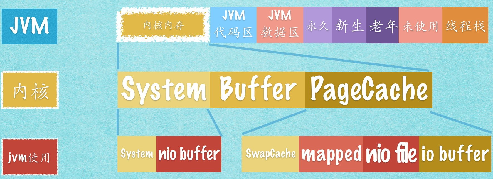

## 阻塞式I/O
每当客户端建立一个tcp连接，服务端都会起一个线程去处理这个连接，不管他是否发送请求报文，这里的请求报文一般常用的就是http报文。由于阻塞，所以只能让服务器开线程并发的处理下一个请求。

优点：适合处理特点是连接少且报文内容多的客户端请求

缺点：创建和切换线程上下文环境是非常消耗资源的。对于连接多，报文内容少的客户端请求，大部分服务端线程都会因客户端建立了tcp连接但发送报文稀疏而进入等待空闲状态，十分浪费资源。虽然可以利用线程池进行一定程度的优化缓解，但解决不了已连接但不发报文的等待问题。（这也是nio改进的方向）
### 阻塞式I/O的server代码
```java
public class BioServer {
    private static ServerSocket server;
    private static ExecutorService ThreadPool = new ThreadPoolExecutor(10, 100,
            5L, TimeUnit.SECONDS,
            new LinkedBlockingQueue<>(1024), new ThreadFactoryBuilder()
            .setNameFormat("collector-pool-%d").build(), new ThreadPoolExecutor.AbortPolicy());
    public static void start(int port) throws IOException {
        if (server != null) {
            return;
        }
        try {
            //通过构造函数创建ServerSocket
            //如果端口合法且空闲，服务端就监听成功
            server = new ServerSocket(port);
            System.out.println("服务器已启动，端口号：" + port);
            //通过无线循环监听客户端连接
            //如果没有客户端接入，将阻塞在accept操作上。
            while (true) {
                //阻塞，直到有客户端与服务端建立tcp连接
                Socket socket = server.accept();
                //用显示创建的线程池处理这条Socket链路
                ThreadPool.execute(() -> {
                    //处理客户端的socket的读写操作,也是阻塞式
                });
            }
        } finally {
            //一些必要的清理工作
            if (server != null) {
                System.out.println("服务器已关闭。");
                server.close();
                server = null;
            }
        }
    }
}
```
## 非阻塞式I/O
非阻塞式I/O也称之为NIO，NIO是jdk1.4开始提供的一种新的IO方式。原来的 I/O 库(在 java.io.*中) 与 NIO 最重要的区别是数据打包和传输的方式。原来的 I/O 以流的方式处理数据，而 NIO 以块的方式处理数据。面向流 的 I/O 系统一次一个字节地处理数据。一个输入流产生一个字节的数据，一个输出流消费一个字节的数据。为流式数据创建过滤器非常容易。链接几个过滤器，以便每个过滤器只负责单个复杂处理机制的一部分，这样也是相对简单的。不利的一面是，面向流的 I/O 通常相当慢。 

一个 面向块 的 I/O 系统以块的形式处理数据。每一个操作都在一步中产生或者消费一个数据块。按块处理数据比按(流式的)字节处理数据要快得多。但是面向块的 I/O 缺少一些面向流的 I/O 所具有的优雅性和简单性。这里需要说明为什么面向块的IO要比面向流的IO要快，举例来说应用程序从磁盘读取数据的时候其实并不是直接从磁盘取数据的而是先由操作系统把磁盘上的数据读到系统内存中，这一步是操作系统的IO，不由应用程序控制；然后应用程序再把数据从系统内存读取到应用内存中去，后一步也就是我们程序中的IO操作。操作系统一般一次将一块的数据由磁盘移动到系统内存上去，**基于块的IO和基于流IO的不同之处在于基于流的IO需要一个个字符的把系统内存上的数据移动到应用内存上去，而基于块的IO会一次一块的将数据移动到应用内存，效率自然是基于块的IO更好。并且在jvm中有一块内存申请的是系统内存，nio的direct buffer用的就是该内存，这减少了一次用户空间和系统空间之间的拷贝，加快读取。**
<div align="center"> linux平台的jvm </div><br>
但在jDK1.4之后，BIO的底层也使用NIO方式进行了部分重写，所以就文件读写效率方面来说，两者差别已经不大，最重要的差别还是NIO提供了异步非阻塞的网络编程模型，这是BIO所不能实现的。

### 异步非阻塞I/O
起作用是为了解决阻塞IO占用大量线程资源的缺点。所谓的非阻塞，就是把服务端的serverSocket的accept()、客户端的socket的connect(), read() 和write()变成了非阻塞，即调用后立刻返回不管是否有值。NIO中的类名为ServerSocketChannel 和 SocketChannel就是上面说的可以配置为非阻塞的socket。但仅仅这样是不够的，一般是需要选择器和通道的配合，才能解决线程资源不够的问题。

### 选择器selector
一个线程 Thread 使用一个选择器 Selector 通过轮询的方式去检查多个通道 Channel 上的事件，从而让一个线程就可以处理多个事件。

因为创建和切换线程的开销很大，因此使用一个线程来处理多个事件而不是一个线程处理一个事件具有更好的性能。

<div align="center">  </div><br>

这里就拿ServerSocketChannel和SocketChannel举例，由于这里的channel都可以设置为非阻塞，所以selector可以不断去轮询所有的channel，每次轮询将有accept()、read()事件的channel统一处理，一个channel对应的就是一个tcp连接，当有报文发送过来时，才会去处理，大大节省了线程资源，实现了一个线程处理多个请求。
### 非阻塞式I/O的server代码
```java
public class NIOServer {

    public static void main(String[] args) throws IOException {
        Selector selector = Selector.open();
        ServerSocketChannel ssChannel = ServerSocketChannel.open();
        // 设置为非阻塞，即accept为非阻塞
        ssChannel.configureBlocking(false);
        // 把ServerSocketChannel注册到selector上，并且指定SelectionKey.OP_ACCEPT，表示只接受连接,不处理数据。
        ssChannel.register(selector, SelectionKey.OP_ACCEPT);

        ServerSocket serverSocket = ssChannel.socket();
        InetSocketAddress address = new InetSocketAddress("127.0.0.1", 8888);
        serverSocket.bind(address);

        while (true) {
            // 轮询阻塞，直到有server的accept或client的read事件产生
            selector.select();
            // keys包含所有有事件的channel
            Set<SelectionKey> keys = selector.selectedKeys();
            Iterator<SelectionKey> keyIterator = keys.iterator();
            while (keyIterator.hasNext()) {
                SelectionKey key = keyIterator.next();
                if (key.isAcceptable()) {
                    // 有客户端进行tcp连接
                    ServerSocketChannel ssChannel1 = (ServerSocketChannel) key.channel();
                    // 服务器会为每个新连接创建一个 SocketChannel
                    SocketChannel sChannel = ssChannel1.accept();
                    // 设置为非阻塞
                    sChannel.configureBlocking(false);
                    // 这个新连接主要用于从客户端读取数据，即制定SelectionKey.OP_READ
                    sChannel.register(selector, SelectionKey.OP_READ);
                } else if (key.isReadable()) {
                    // 处理客户端发来的报文
                    SocketChannel sChannel = (SocketChannel) key.channel();
                    System.out.println(readDataFromSocketChannel(sChannel));
                    sChannel.close();
                }
                // 需要把处理完的channel删除，防止重复处理
                keyIterator.remove();
            }
        }
    }

    private static String readDataFromSocketChannel(SocketChannel sChannel) throws IOException {
        ByteBuffer buffer = ByteBuffer.allocate(1024);
        StringBuilder data = new StringBuilder();
        while (true) {
            buffer.clear();
            int n = sChannel.read(buffer);
            if (n == -1) {
                break;
            }
            buffer.flip();
            int limit = buffer.limit();
            char[] dst = new char[limit];
            for (int i = 0; i < limit; i++) {
                dst[i] = (char) buffer.get(i);
            }
            data.append(dst);
            buffer.clear();
        }
        return data.toString();
    }
}
```
## 总结
可以从上面代码看到一个线程处理多个请求，这也是多亏了非阻塞的功劳，当然也可以起一个线程池去处理待处理的channel来实现高并发。nio中的selector只做了少量的封装，只是把轮询channel的工作给做了，并不是非常简便，netty在此基础上又进行了一次封装，使用netty可以专注于业务逻辑的编写，不用过多地去关心连接的逻辑。
## 拓展
上面基本上说的都是服务端的nio，之前的selector思想也称之为多路复用，即一个seletor处理多个请求。拿http协议来举例：

在http协议1.0及之前默认都是短连接，建立三次握手后，发送完一个http报文，就会四次挥手断开连接，建立tcp连接是非常耗时的，这样做显然是不太合适的。在http协议1.1中默认是长连接，可以在一次tcp连接中加入多个http请求报文，来缓解服务器压力。包括后面的协议2.0的多路复用，来实现在一个连接中并发地处理多个请求的，而且并发请求的数量比HTTP1.1大了好几个数量级。

