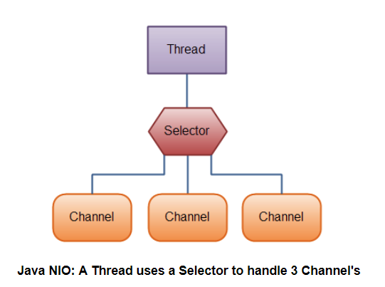

## 阻塞式I/O
每当客户端建立一个tcp连接，服务端都会起一个线程去处理这个连接，不管他是否发送请求报文，这里的请求报文一般常用的就是http报文。

优点：适合处理特点是连接少且报文内容多的客户端请求

缺点：线程资源是很宝贵的，对于连接多，报文内容少的客户端请求，大部分服务端线程都会因客户端建立了tcp连接但发送报文稀疏而进入等待空闲状态，十分浪费资源。虽然可以利用线程池进行一定程度的优化缓解，但解决不了已连接但不发报文的等待问题。（这也是nio改进的方向）
### 同步阻塞式I/O的server代码
```java
public class BioServer {
    private static ServerSocket server;
    private static ExecutorService ThreadPool = new ThreadPoolExecutor(10, 100,
            5L, TimeUnit.SECONDS,
            new LinkedBlockingQueue<>(1024), new ThreadFactoryBuilder()
            .setNameFormat("collector-pool-%d").build(), new ThreadPoolExecutor.AbortPolicy());
    public static void start(int port) throws IOException {
        if (server != null) {
            return;
        }
        try {
            //通过构造函数创建ServerSocket
            //如果端口合法且空闲，服务端就监听成功
            server = new ServerSocket(port);
            System.out.println("服务器已启动，端口号：" + port);
            //通过无线循环监听客户端连接
            //如果没有客户端接入，将阻塞在accept操作上。
            while (true) {
                //阻塞，直到有客户端与服务端建立tcp连接
                Socket socket = server.accept();
                //用显示创建的线程池处理这条Socket链路
                ThreadPool.execute(() -> {
                    //处理客户端的socket的读写操作,也是阻塞式
                });
            }
        } finally {
            //一些必要的清理工作
            if (server != null) {
                System.out.println("服务器已关闭。");
                server.close();
                server = null;
            }
        }
    }
}
```
## 非阻塞式I/O
非阻塞式I/O也称之为NIO，就是为了解决阻塞IO的缺点。所谓的非阻塞，就是把服务端的serverSocket的accept()、客户端的socket的connect(), read() 和write()变成了非阻塞，即调用后立刻返回不管是否有值。NIO中的类名为ServerSocketChannel 和 SocketChannel就是上面说的可以为非阻塞的socket。但仅仅这样是不够的，

<div align="center">  </div><br>
